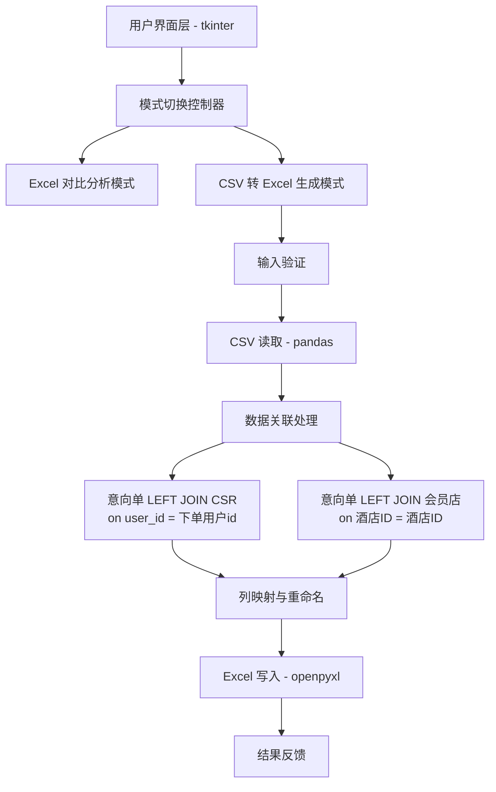
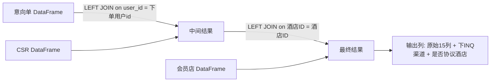

# 设计文档

## 概述

在现有的 `ExcelAnalyzerApp` tkinter 桌面应用中新增"CSV 转 Excel 生成"功能模块。该模块允许用户上传三个 CSV 文件（意向单、CSR、会员店），通过 pandas 进行数据关联（LEFT JOIN），生成包含增强列（"下INQ渠道"、"是否协议酒店"）的 Excel 文件。

核心设计决策：
- 在现有 `ExcelAnalyzerApp` 类中扩展，通过模式切换（RadioButton）在"Excel 对比分析"和"CSV 转 Excel 生成"之间切换 UI
- 复用现有的日志、进度条、线程处理模式
- 数据处理逻辑封装为独立方法，与 UI 逻辑分离

## 架构



整体架构保持单文件结构（`app.py`），在 `ExcelAnalyzerApp` 类中新增以下职责：
1. 模式切换 UI 控件与事件处理
2. CSV 文件选择 UI（三个文件 + 输出路径）
3. 数据关联处理逻辑
4. 输入验证逻辑

## 组件与接口

### 1. 模式切换组件

在 `_build_ui()` 方法顶部新增模式选择区域：

```python
self.app_mode = tk.StringVar(value="excel_compare")  # 默认模式
```

- `"excel_compare"` → 显示现有 Excel 对比分析 UI
- `"csv_to_excel"` → 显示 CSV 转 Excel 生成 UI

切换时通过 `_on_mode_change()` 方法控制两组 UI 控件的 `pack()`/`pack_forget()` 显示隐藏。

### 2. CSV 文件选择组件

新增三个文件路径变量和对应 UI 控件：

```python
self.csv_yxd_path = tk.StringVar()   # 意向单 CSV
self.csv_csr_path = tk.StringVar()   # CSR CSV
self.csv_hyd_path = tk.StringVar()   # 会员店 CSV
self.csv_output_path = tk.StringVar() # 输出 xlsx 路径
```

文件选择对话框筛选器：`[("CSV 文件", "*.csv"), ("所有文件", "*.*")]`

### 3. 数据处理接口

```python
def _do_csv_to_excel(self, yxd_path: str, csr_path: str, hyd_path: str, output_path: str) -> None:
    """
    核心数据处理方法，在后台线程中执行。
    
    步骤：
    1. 读取三个 CSV 文件（UTF-8 编码）
    2. 验证必需列存在
    3. 执行两次 LEFT JOIN
    4. 选择并排序输出列
    5. 写入 Excel 文件
    """
```

```python
def _validate_csv_columns(self, df: pd.DataFrame, required_cols: list[str], file_label: str) -> None:
    """
    验证 DataFrame 包含必需列，缺失时抛出 ValueError。
    """
```

```python
def _run_csv_to_excel(self) -> None:
    """
    "开始生成"按钮的事件处理器。
    验证输入路径 → 禁用按钮 → 启动后台线程。
    """
```

### 4. 模式切换接口

```python
def _on_mode_change(self) -> None:
    """
    根据 self.app_mode 的值切换显示对应模式的 UI 控件。
    """
```

## 数据模型

### CSV 文件结构

**意向单 CSV 列：**
| 列名 | 类型 | 说明 |
|------|------|------|
| number | str | 意向单编号 |
| 省 | str | 省份 |
| 城市 | str | 城市 |
| 等级 | str | 等级 |
| user_type | str | 用户类型 |
| user_id | str | 用户ID（关联键） |
| name | str | 姓名 |
| 客户手机号 | str | 手机号 |
| supplier_type | str | 供应商类型 |
| supplier_id | str | 供应商ID |
| 酒店ID | str | 酒店ID（关联键） |
| 酒店名称 | str | 酒店名称 |
| 上架状态 | str | 上架状态 |
| source | str | 来源 |
| created_at | str | 创建时间 |

**CSR CSV 关联列：**
| 列名 | 类型 | 说明 |
|------|------|------|
| 下单用户id | str | 关联键（对应意向单 user_id） |
| 来源线索 | str | 映射为结果中的"下INQ渠道" |

**会员店 CSV 关联列：**
| 列名 | 类型 | 说明 |
|------|------|------|
| 酒店ID | str | 关联键（对应意向单 酒店ID） |
| 是否会员店 | str | 映射为结果中的"是否协议酒店" |

### 数据关联流程



**关联细节：**
1. JOIN 前将关联键统一转为 `str` 类型（`astype(str).str.strip()`）
2. CSR 可能有多条记录匹配同一 user_id，需先对 CSR 按 `下单用户id` 去重（保留第一条）或使用 `drop_duplicates`，避免意向单行数膨胀
3. 会员店的 `酒店ID` 应唯一，但同样做去重保护

### 输出 Excel 结构

| Sheet 名 | 列 |
|----------|-----|
| 意向单详细数据 | number, 省, 城市, 等级, user_type, user_id, name, 客户手机号, supplier_type, supplier_id, 酒店ID, 酒店名称, 上架状态, source, created_at, 下INQ渠道, 是否协议酒店 |

## 正确性属性

*属性（Property）是指在系统所有有效执行中都应成立的特征或行为——本质上是对系统应做什么的形式化陈述。属性是人类可读规范与机器可验证正确性保证之间的桥梁。*

### 属性 1：LEFT JOIN 保持行数不变

*对于任意*意向单 DataFrame 和任意 CSR/会员店 DataFrame，执行数据关联处理后，结果 DataFrame 的行数应等于原始意向单 DataFrame 的行数。

**验证需求：3.2, 3.3**

### 属性 2：列值映射正确性

*对于任意*意向单记录，若其 user_id 在 CSR 中存在匹配记录，则结果中该行的"下INQ渠道"值应等于 CSR 中对应的"来源线索"值；若其酒店ID 在会员店中存在匹配记录，则结果中该行的"是否协议酒店"值应等于会员店中对应的"是否会员店"值。

**验证需求：3.4, 3.5, 3.6, 3.7**

### 属性 3：输出列结构与顺序

*对于任意*有效的输入数据（三个 CSV 文件均包含必需列），处理后的结果 DataFrame 应恰好包含 17 列，且列顺序为：number、省、城市、等级、user_type、user_id、name、客户手机号、supplier_type、supplier_id、酒店ID、酒店名称、上架状态、source、created_at、下INQ渠道、是否协议酒店。

**验证需求：4.3, 4.4**

### 属性 4：列验证拒绝缺失必需列

*对于任意*缺少至少一个必需关联列的 DataFrame，列验证函数应抛出错误，且错误信息中应包含所有缺失列的名称。

**验证需求：6.3, 6.4**

## 错误处理

| 错误场景 | 处理方式 | 用户反馈 |
|----------|----------|----------|
| CSV 文件路径未选择 | 在 `_run_csv_to_excel()` 中前置检查 | 弹出警告对话框，提示选择所有文件 |
| 输出路径未选择 | 在 `_run_csv_to_excel()` 中前置检查 | 弹出警告对话框，提示选择输出路径 |
| CSV 文件编码错误 | pandas `read_csv` 抛出 UnicodeDecodeError | 日志显示错误 + 弹出错误对话框 |
| CSV 缺少必需列 | `_validate_csv_columns()` 抛出 ValueError | 日志显示具体缺失列名 + 弹出错误对话框 |
| CSV 文件为空 | pandas 读取后 DataFrame 为空 | 日志警告但继续处理（生成空结果） |
| 输出路径无写入权限 | `to_excel()` 抛出 PermissionError | 日志显示错误 + 弹出错误对话框 |
| 关联键类型转换失败 | `astype(str)` 一般不会失败 | 若异常则捕获并显示错误 |

所有错误在 `_do_csv_to_excel()` 的 `try/except` 块中统一捕获，通过 `self.root.after()` 在主线程中弹出对话框，并在 `finally` 中恢复按钮状态和停止进度条。

## 测试策略

### 属性测试（Property-Based Testing）

使用 `hypothesis` 库进行属性测试，每个属性测试至少运行 100 次迭代。

将数据处理逻辑提取为纯函数（不依赖 tkinter UI），以便进行属性测试：

```python
def process_csv_data(df_yxd: pd.DataFrame, df_csr: pd.DataFrame, df_hyd: pd.DataFrame) -> pd.DataFrame:
    """纯数据处理函数，可独立于 UI 测试。"""
```

```python
def validate_columns(df: pd.DataFrame, required_cols: list[str], file_label: str) -> None:
    """纯验证函数，缺失列时抛出 ValueError。"""
```

**属性测试清单：**

| 属性 | 测试标签 | 生成器策略 |
|------|----------|-----------|
| 属性 1 | Feature: csv-to-excel-generator, Property 1: LEFT JOIN 保持行数不变 | 生成随机行数的意向单/CSR/会员店 DataFrame，ID 值随机（含部分重叠） |
| 属性 2 | Feature: csv-to-excel-generator, Property 2: 列值映射正确性 | 生成随机数据，确保部分 ID 匹配、部分不匹配 |
| 属性 3 | Feature: csv-to-excel-generator, Property 3: 输出列结构与顺序 | 生成随机行数的有效 DataFrame |
| 属性 4 | Feature: csv-to-excel-generator, Property 4: 列验证拒绝缺失必需列 | 生成随机列名集合（随机移除必需列） |

### 单元测试

- 使用 `pytest` 进行示例测试
- 测试 UI 模式切换（控件可见性）
- 测试文件路径验证（空路径警告）
- 测试使用示例 CSV 文件的端到端流程
- 测试 sheet 名称为"意向单详细数据"

### 集成测试

- 使用 `excel_analyzer/sample/` 目录下的示例文件进行端到端测试
- 验证生成的 Excel 文件可被 pandas 正确读取
- 验证现有 Excel 对比分析功能不受影响（回归测试）

